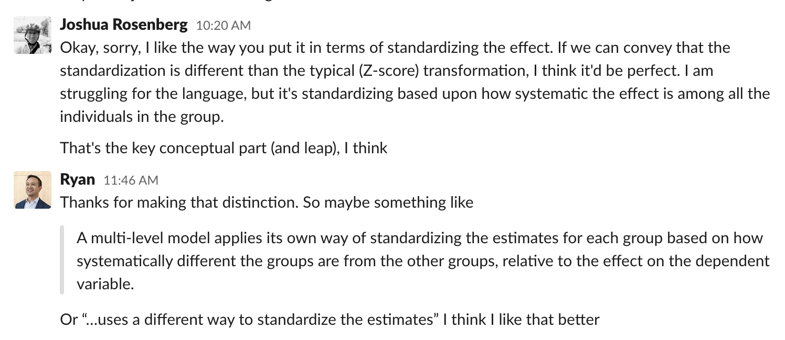

```{r include=FALSE}
# Install {dataedu} package
# devtools::install_github("data-edu/dataedu")
```

```{r load packages, include=FALSE}
library(tidyverse)
library(here)
library(dataedu)
library(knitr)
```

```{r include=FALSE}
opts_chunk$set(echo = FALSE, message = FALSE)
```

```{r read data}
classwork_df <-  read_csv(here::here("data", "classwork_df.csv"))
```

```{r}
classwork_df <- classwork_df %>% 
  # Change to factor so we can reorder later
  mutate(classwork_number = as.factor(classwork_number)) %>% 
  # Remove observation with missing score. Drops 1 observation
  filter(!is.na(score))
```

```{r}
include_graphics("marvin-meyer-SYTO3xs06fU-unsplash.jpg")
```

## Introduction 

When we wrote Data Science in Education Using R (DSIEUR), we knew it would be easy to assume new learners would have more prior knowledge about R than they actually did–a phenomenon economists Colin Camerer, George Loewenstein, and Martin Weber called “[the curse of knowledge](https://en.wikipedia.org/wiki/Curse_of_knowledge)”. We knew this intuitively because, as more experienced R users, we only vaguely associate feelings of triumph and frustration with the memory of running that first chunk of R code. The details of where we got stuck in our learning are harder to recollect. 

Over time, we trade in fresh memories of these learning pain points for experience and ease of use. That led to a design problem we had to solve while writing DSIEUR: How do we write with empathy for new learners when our own memories of learning R have gotten foggier?

To better identify with the learning experiences of others, we needed to identify where our blind spots were. And to identify our blind spots, we needed strategies to empower others to give us feedback by sharing. Sharing with each other, with the R community, and with our publisher were our strategies to do just this.
Collaborate with people from different perspectives to help you cover your blind spots 

## Collaborate with people from different perspectives to help you cover your blind spots 

As we neared the end of the DSIEUR manuscript, we set out to review each chapter and edit it for readability. To create an opportunity for fresh eyes to view the content, we each reviewed a chapter we hadn’t written. Ryan picked Chapter 13, which is on using multilevel models to analyze a student survey dataset about online coursework. Having a new perspective on experiencing the chapter–particularly when the chapter includes lots of technical explanations–turned out to be a great way to discover blind spots in our work. 

Here’s Ryan on what that experience was like: “I don’t use multilevel models regularly in my daily work, so I could tell right away I was going to learn something new. I read through the sections to make small edits but also took breaks every so often to check my comprehension of the concepts.”

About halfway through the chapter review, we started a great conversation and brainstorm about how to convey how standardizing coefficients work in multilevel models. Thinking back, we see that our different experiences with multilevel models were critical for accomplishing two things: identifying areas where the writing could be clearer and improved the writing in a way that stayed true to the technical details of the topic. 

We read through the chapter and picked sections that didn’t feel clear. Then we had conversations to clarify how standardizing coefficients work in multilevel models. Then we wrote to convey the ideas from our conversation. Then we read the section again. And round and round we went until finally we arrived at an execution we were happy with. 

```{r}

```

In this way, we supercharged the iterative writing process with two elements of collaboration. First, differing backgrounds gave us an opportunity to find blind spots. Josh has used, taught, and written about multilevel models regularly for years. Ryan had a basic understanding of the concepts, but less experience using them. And second, a collective goal–in this case, writing a book together– motivated us to communicate openly and experiment with different ways to create a great experience for our readers.

## Write in the open to get feedback from readers

There are all kinds of ways to build empathy for new learners, like “listening” on social media, interviewing community members, and regularly trying to learn new things ourselves. Using open source materials is another approach---one that the R community and others have embraced. [Open source educational resources, software, and science make code available to readers to encourage collaboration and accountability](https://rviews.rstudio.com/2020/07/01/open-source-authorship-of-data-science-in-education-using-r/). But can open source writing also help us check our biases about what learners need by including the learners themselves in the development of materials?

When data scientists share their writing and code through sites like GitHub and Kaggle, that sharing comes with an unspoken invitation to communicate with the authors. Most of the time, that communication is about improving code. When the open source project is designed to teach something new, the communication can also be about improving the learning experience. 

Consider a scenario where a classroom teacher asks their students to complete worksheets, an example of closed source education materials. Not only do worksheets hide the underlying thinking behind their creation they also invite compliance more than they invite any conversation about what the learner needs.

On the other hand, providing the code for our book empowers us to share *how* we thought through an analysis. It also sets the tone for conversation on social media platforms and GitHub about how we can improve the book. 

Let’s look at an example from our book. In chapter 8, we created a visualization to explore scores from student classwork assignments:

```{r plot, fig.align='center', echo=TRUE}
# Scatterplot of continuous variable
classwork_df %>%
  ggplot(aes(x = reorder(classwork_number, -score, median),
             y = score,
             fill = classwork_number)) +
  geom_boxplot() +
  labs(title = "Distribution of Classwork Scores",
       x = "Classwork",
       y = "Scores") +
  scale_fill_dataedu() +
  theme_dataedu() +
  theme(
    # removes legend
    legend.position = "none",
    # angles the x axis labels
    axis.text.x = element_text(angle = 45, hjust = 1)
    )
```

By making the code for this plot [available](https://github.com/data-edu/rstudio_edu_post), we invited readers (implicitly by being openly available but also explicitly by requesting feedback via Twitter) to tell us where we could have done more to scaffold the lesson. For example, a reader might tell us they need a better explanation of how `reorder()` is used to arrange the boxplots by median scores. 

In other cases, readers let us know when the writing itself didn’t make sense. For example, one reader read the online version of DSIEUR and pointed out that a plot that showed the importance of different variables in predicting a student’s final grade didn’t match the interpretation. It turns out we made revisions to the analysis that changed the plot, but we hadn’t updated the plot’s interpretation. We tracked this feedback and others in a [GitHub issue] and corrected it. 
 
Indeed, while writing DSIEUR, sharing the book and its code led to [conversations](https://twitter.com/rrherr/status/1254208054008205314) and [opportunities for improvement](https://github.com/data-edu/data-science-in-education/issues/525). 

## Tangible goals support creativity and feedback

When we as creators make educational materials, working toward a concrete, tangible product---like a book---can force us to encounter our oversights and blind spots.

If you’ve written a blog or social media post before, you might recognize the feeling: As soon as you publish the post, you find gaps (or typos!) in your writing you feel motivated to fix. Moreover, if you write a blog post in RMarkdown, the process of publishing the post will expose issues, warnings, or messages related to the code—-issues you may wish to address before (or after) publishing the post. Knowing someone will read your work gives that extra bit of productive pressure to offer value to your readers. Indeed, the audience has a role to pay in the creative process because they aren’t just reading, they’re participating. Conversations can start in the comment section or on social media. These conversations help you learn how well you connected with the audience. 

Publishing a book online provides many opportunities to come into contact with a similar phenomenon. When we first published the bookdown-based version of the book, we were so proud of what we created. But we also realized that parts of the book needed to be revised, copy-edited, and, in a few cases, written. We were motivated to revise the book with an urgency we likely wouldn’t have had if our writing remained an RMarkdown document in our book’s repository. 

Publishing the book in print brought us a new and unexpected source of valuable feedback. The nitty-gritty process of publishing a book with a publisher, Routledge, provided even more opportunities to encounter our blind spots. The publishing process did this in two ways. First, at the proposal stage, we received feedback from our editor and reviewers; both helped us think about how we can broaden and clarify the audience of our book, something we might not have (formally) done on our own. Second, the publishing requirements at first seemed, to be frank, just a matter of procedure. Instead, they ended up serving as an unexpected cause of improvements to the writing. 

For instance, the specifications for the delivery of our book to our publisher required us to [standardize the levels of our headings](https://github.com/data-edu/data-science-in-education/issues?q=is%3Aissue+headings); standardizing our headings is a detail we might not have considered on our own. 

Working through the copy-edits with our publisher helped (or forced!) us to encounter other parts of our writing that we had not considered: We realized very late in the process that we used both the singular and plural form of “data” throughout the manuscript (without expressed reasons for doing so!). Even an early [GitHub issue](https://github.com/data-edu/data-science-in-education/issues/20) about this very topic hadn’t prompted the same level of urgency as the copy-edits did. While more particular than the broader blind spots discovered through collaboration and writing in the open, these blind spots are critical for creating a clear, professional, and readable book for the audience. 

Finally, having a deadline for the manuscript motivated us to improve our communication process. In Change By Design, Tim Brown writes, “Curse deadlines all you want, but remember that time can be our most creative constraint.” Indeed, the frequency of team calls and the commitment to revising and finalizing our manuscript grew as our deadline approached. Thus, our publisher’s deadline provided a structure that encouraged organization, efficient decision-making and problem-solving, and collaboration. 

In sum, working toward a concrete product, especially a book with particular requirements, is a way to encounter your blind spots as an author and raise the quality of your work. Writing for an audience in general, whether it be for a book or a social media post, can be an effective way to identify and address blongspots in your writing. 

## Conclusion 

In the end, the solution for writing the best book we could for new R users in the education field was to empower the community with tools to look at our work and share their reactions with us. Writing Data Science in Education Using R in the open was a way for us to express what we’ve learned, but also a way for us to keep learning. 
