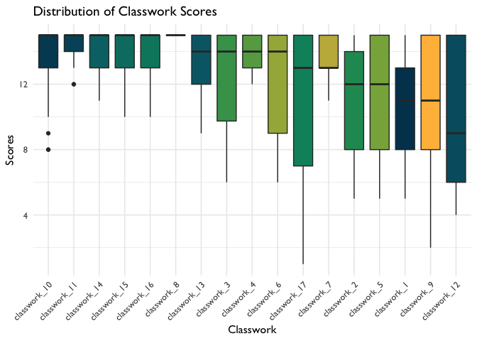

Writing Data Science in Education Using R in the Open: We’re Learning
Too
================
Ryan Estrellado and Joshua Rosenberg
7/9/2020

<!-- -->

When we wrote Data Science for Education Using R, we knew it would be
easy to assume new learners would have more prior knowledge about R than
they actually did. We knew this intuitively because, as more experienced
R users (at this point in time!), we only vaguely associate feelings of triumph and frustration
with the memory of running that first chunk of R code. The details of
where we got stuck in our learning are harder to recollect. After all, as
new R learners we were, as our co-author [Jesse puts
it](https://twitter.com/kierisi/status/1100227355543359488?s=20), “going
from using our computers for Netflix to using them for programming and
data science.”

Over time, we trade in fresh memories of our learning pain points for
experience and ease of use. That led to a design (and, we think, educational)
problem we had to solve while writing Data Science in Education Using R: How do we write with
empathy for new learners when our own memories about learning R have
gotten foggier?.

## Creating Open Source Materials as a Way to Learn From Others

There are all kinds of ways to build empathy for new learners, like
“listening” (you can call it lurking!) on social media, interviewing community members, and
regularly trying to learn new things ourselves. Using open source
materials is another approach—one that the R community and others have
embraced. [Open source educational resources, software, and science make
code available to readers to encourage collaboration and
accountability](https://rviews.rstudio.com/2020/07/01/open-source-authorship-of-data-science-in-education-using-r/).
But can open source writing also help us check our biases about what
learners need by including the learners themselves in the development of
materials?

When data scientists share their writing and code through sites like
GitHub and Kaggle, that sharing comes with an unspoken invitation to
communicate with the authors. Most of the time, that communication is
about improving code. When the open source project is designed to teach
something new, the communication can also be about improving the
learning experience.

Consider a scenario where a classroom teacher asks their students to
complete worksheets, an example of closed source education materials.
Not only do worksheets hide the underlying thinking behind their
creation, they also invite compliance more than they invite any
conversation about what the learner needs.

On the other hand, providing the code for our book empowers us to share
*how* we thought through an analysis. It also sets the tone for
conversation on social media platforms and GitHub about how we can
improve the book.

Let’s look at an example from our book. In chapter 8, we created a
visualization to explore scores from student classwork assignments:

``` r
# Scatterplot of continuous variable
classwork_df %>%
  ggplot(aes(x = reorder(classwork_number, -score, median),
             y = score,
             fill = classwork_number)) +
  geom_boxplot() +
  labs(title = "Distribution of Classwork Scores",
       x = "Classwork",
       y = "Scores") +
  scale_fill_dataedu() +
  theme_dataedu() +
  theme(
    # removes legend
    legend.position = "none",
    # angles the x axis labels
    axis.text.x = element_text(angle = 45, hjust = 1)
    )
```

<!-- -->

By making the code for this plot
[available](https://github.com/data-edu/rstudio_edu_post), we invited
readers to tell us where we could have done more to scaffold the lesson.
For example, a reader might tell us they need a better explanation of
how `reorder()` is used to arrange the boxplots by median scores.

Indeed, while writing Data Science in Education Using R, sharing the
book and its code publicly led to
[conversations](https://twitter.com/rrherr/status/1254208054008205314)
and [opportunities for
improvement](https://github.com/data-edu/data-science-in-education/issues/525).

## Conclusion

In the end, the solution for writing the best book we could for new R
users in the education field was to empower the community with tools to
look at our work and share their reactions with us. Writing Data Science
in Education Using R in the open was a way for us to admit that we
ourselves are learning.
